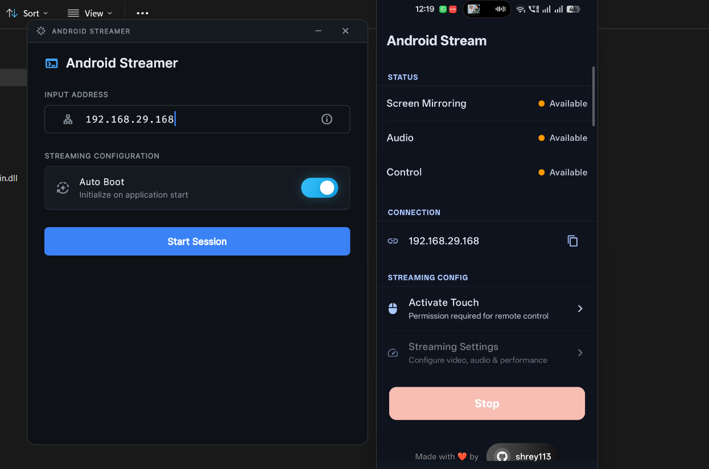

## 🚀 App-Scrcpy

### Wireless Android Screen & Audio Streaming to Windows

Mirror your Android screen to your Windows PC — with **real-time audio**, **low latency**, and **full remote control**.
No USB. No ADB. No root. No drivers. Just Wi-Fi.

---

## ⚡ Quick Start

| Platform       | Download                                                                                                       |
| -------------- | -------------------------------------------------------------------------------------------------------------- |
| Android APK | [Download APK](https://github.com/Shrey113/App-Scrcpy/releases/latest/download/Android_Stream_Installer.apk)   |
| Windows CMD | [Download CMD](https://github.com/Shrey113/App-Scrcpy/releases/latest/download/Android_Stream_windows_cmd.zip) |
| Windows GUI | [Download GUI](https://github.com/Shrey113/Adb-Device-Manager-2) |
| Linux / Mac | Coming Soon ⌛                                                                                                  |
| Setup Guide | [View Guide](https://shrey113.github.io/App-Scrcpy/data/setup_guide.html)                                      |
| Website     | [Visit Website](https://shrey113.github.io/App-Scrcpy/)                                                        |
|How use CMD | [How use CMD](https://github.com/Shrey113/App-Scrcpy/blob/main/data/README_file/CMD_USAGE.md)

 

>
>⚠️ Important
> 
> **App-Scrcpy** is part of **Adb-Device-Manager-2**.  
> From **v1.5**, it's also available as a standalone lightweight app . Full Project - [Adb-Device-Manager-2](https://github.com/Shrey113/Adb-Device-Manager-2)
> 
>
 

### 📊 Feature Overview

| Feature             | Android App | Works on Lock Screen |
| ------------------- | ----------- | -------------------- |
| Screen Streaming | ✅ Yes       | ❌ No                 |
| Internal Audio   | ✅ Yes       | ✅ Yes                |
| Full Control     | ✅ Yes       | ❌ No                 |

### ✨ What Makes It Special?

App-Scrcpy is built for **performance**, **stability**, and **real control**.

You get:

✔ Real-time screen streaming (H.264 hardware encoded)
✔ Internal system audio streaming (48kHz stereo)
✔ Full touch control
✔ Adaptive bitrate for smooth performance
✔ Audio-only mode

All over your **local Wi-Fi network**.

---

### 🧠 How It Works (Simple Version)

The Android app:

* Captures your screen using **MediaProjection**
* Captures internal audio (Android 10+)
* Encodes video using hardware H.264
* Hosts a lightweight WebSocket server

The Windows app:

* Connects using your phone’s IP
* Decodes video with FFmpeg
* Plays audio using PortAudio
* Renders video with SDL2
* Sends mouse & keyboard input back to your phone

Everything runs in real time.(*Depend on your wifi speed & Device performance)

---

### ⌨ Windows Hotkeys

| Shortcut | Action            |
| -------- | ----------------- |
| Ctrl + F | Toggle Fullscreen |
| Ctrl + W | Toggle Border     |
| Ctrl + S | Open Settings     |
| Ctrl + B | Go Back     |
| Ctrl + R | Open Recent Apps     |
| Ctrl + H | Go to Home Screen     |

---

### Lock-Free Audio Engine

Audio uses a real-time ring buffer to prevent glitches and robotic sound.

### Adaptive Bitrate

If Wi-Fi slows down, quality adjusts automatically to keep the stream smooth.

---

### Android Requirements

* Android 10+ (for audio capture)
* Accessibility permission (for remote control)
* Screen capture permission

### Windows Requirements

* Windows 10 or newer
* Same local network as your phone
* No installation required (portable app)

---

### 🚀 How To Use

1. Install Android APK
2. Grant required permissions
3. Note your phone’s local IP
4. Open Windows app
5. Enter IP → Click Connect

That’s it.

Your screen appears in seconds.

---

### 💡 Why App-Scrcpy?

Because it’s:

* Lightweight
* Fast
* Clean architecture
* Built from scratch
* Designed for stability
* Made for real usage

---
### Sample Images

---

**Built by Shrey**
GitHub: [https://github.com/Shrey113/App-Scrcpy](https://github.com/Shrey113/App-Scrcpy)
Website: [https://shrey113.github.io/App-Scrcpy/](https://shrey113.github.io/App-Scrcpy/)

